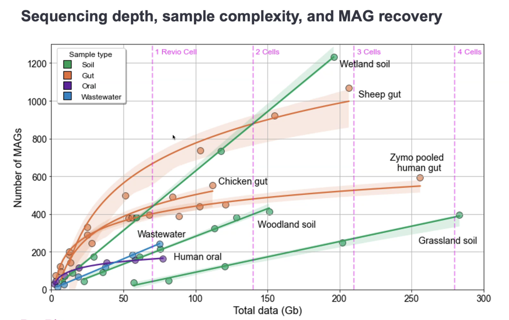
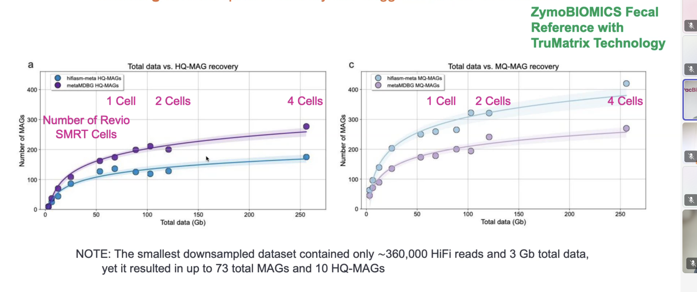
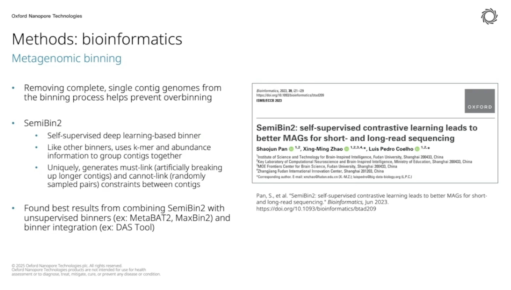

[](https://github.com/eparisis/microbial-assembly-demo)
[](https://github.com/mikolmogorov/Flye)
[](https://docs.conda.io/en/latest/)

# Microbial Genome Assembly with Flye

A mini tutorial for MSc students on performing *de novo* microbial genome assembly using long reads with [Flye](https://github.com/fenderglass/Flye).

## Running this tutorial with Github Codespaces

You can run this tutorial with Github Codespaces by clicking the button below:

[](https://codespaces.new/eparisis/microbial-assembly-demo)

---

## Table of Contents

1. [Background](#background)
2. [How Flye Works](#how-flye-works)
3. [Flye vs Other Assemblers](#flye-vs-other-assemblers)
4. [Installation](#installation)
5. [Running Flye](#running-flye)
6. [Flye Options Explained](#flye-options-explained)
7. [Things to Watch Out For](#things-to-watch-out-for)
8. [Binning for Metagenome Assemblies](#8-binning-for-metagenome-assemblies)
8. [Assessing Assembly Quality](#assessing-assembly-quality)
9. [What Matters for a Good Assembly Outcome?](#what-matters-for-a-good-assembly-outcome)

---

## Background

Microbial genome assembly is the process of reconstructing a complete (or near-complete) genome from sequencing reads. With **long-read technologies** (Oxford Nanopore, PacBio), we can now routinely produce complete, closed microbial genomes — something that was very difficult with short reads alone.

**Flye** is a *de novo* assembler specifically designed for long and noisy reads (PacBio and Oxford Nanopore). It is one of the most widely used long-read assemblers for microbial genomes due to its speed, accuracy, and ability to resolve repetitive regions.

---

## How Flye Works

Flye uses a fundamentally different approach from traditional overlap-layout-consensus (OLC) assemblers. Here is a simplified overview:

### 1. Repeat Graph Construction

Instead of building a traditional overlap graph from all reads, Flye constructs a **repeat graph** (also called an A-Bruijn graph). The key idea is:

- Flye first identifies **approximate repeat regions** in the reads
- It builds a graph where unique genomic regions are represented as edges and repeat boundaries as nodes
- This approach handles repeats explicitly from the start, rather than trying to resolve them later

### 2. Disjointig Assembly

Flye generates **disjointigs** — concatenated sequences of unique genomic segments. These are not contigs in the traditional sense; they represent maximal paths through unique (non-repetitive) regions of the genome.

### 3. Consensus and Polishing

- Reads are mapped back to the disjointigs
- A consensus sequence is generated
- Multiple rounds of polishing refine the sequence accuracy

### 4. Repeat Resolution

- Using the repeat graph and read information, Flye attempts to **resolve repeats** — determining which copies of a repeat connect to which flanking unique regions
- For microbial genomes, this often results in **complete, circular chromosomes**

---

## Flye vs Other Assemblers

### Flye vs SPAdes (Short-Read Assembler)

| Feature | Flye | SPAdes |
|---------|------|--------|
| **Input data** | Long reads (ONT, PacBio) | Short reads (Illumina); also has hybrid mode |
| **Graph type** | Repeat graph (A-Bruijn graph) | de Bruijn graph (using k-mers) |
| **Repeat handling** | Resolves repeats using long-range read information | Struggles with repeats longer than read/insert length |
| **Typical output** | Few contigs, often complete circular chromosomes | Many contigs, fragmented assemblies for complex genomes |
| **Error profile** | Must handle higher per-base error rates from long reads | Benefits from high per-base accuracy of Illumina |
| **Genome completeness** | Often achieves complete genomes for bacteria | Typically produces draft-quality assemblies |
| **Speed** | Fast for microbial genomes | Fast for microbial genomes |

**Why does SPAdes fragment?** SPAdes uses a de Bruijn graph, which breaks reads into k-mers (short subsequences of length *k*). Any repeat longer than *k* creates ambiguity — the assembler cannot determine how to traverse through the repeat. Since typical Illumina reads are 150-300 bp, repeats longer than this (e.g., IS elements ~1-2 kb, rRNA operons ~5 kb) cause fragmentation.

**Why does Flye succeed?** Long reads (often 5-50+ kb) physically span most bacterial repeats, giving Flye the information needed to resolve them.

### Flye vs Other Long-Read Assemblers

| Feature | Flye | Canu | Hifiasm | metaMDBG |
|---------|------|------|---------|----------|
| **Primary strength** | Speed + repeat resolution | Accuracy, robust error correction | HiFi read assembly | High-complexity metagenomes |
| **Best input** | ONT/PacBio CLR/HiFi | ONT/PacBio CLR | PacBio HiFi | PacBio HiFi / ONT (metagenomes) |
| **Speed** | Fast | Slow (compute-intensive) | Fast | Fast |
| **Memory usage** | Moderate | High | Moderate | Low |
| **Repeat resolution** | Excellent (repeat graph) | Good (overlap-based) | Excellent for HiFi | Good (minimizer-based) |
| **Metagenome support** | Yes (`--meta` flag) | Yes (meta mode) | No | Native (designed for it) |


#### metaMDBG

[metaMDBG](https://github.com/GaetanBenoitDev/metaMDBG) is a relatively new long-read metagenome assembler that deserves special attention. It was specifically designed for assembling **complex metagenomes** from long reads (PacBio HiFi and Oxford Nanopore).

**How it differs from Flye:**

- **Algorithm**: metaMDBG uses a **minimizer de Bruijn graph** approach — a hybrid between traditional de Bruijn graphs and long-read methods. It builds a de Bruijn graph from minimizers (a subset of k-mers) rather than all k-mers, which keeps the graph manageable while still leveraging long-read information.
- **Multi-k approach**: Like SPAdes, metaMDBG iterates over multiple k-mer (minimizer) sizes, starting small and increasing. This helps resolve both low-coverage and high-coverage genomes in the same sample.
- **Strain resolution**: metaMDBG excels at separating closely related strains in complex communities — a major challenge for other assemblers.
- **Resource efficiency**: It uses significantly less memory and CPU time than Flye in `--meta` mode for large metagenomic datasets.

**When to use metaMDBG over Flye:**

- You have **PacBio HiFi or Nanopore metagenomic** data
- Your sample is a **high-complexity metagenome** (e.g., soil, gut, wastewater) with many species
- You need **strain-level resolution**
- You are working with large datasets and need lower resource usage

**When to stick with Flye:**

- You are assembling an **isolate genome** (single organism)
- You need a well-established tool with extensive community support


---

## Installation

We will use **mamba** (a faster drop-in replacement for conda) to install Flye in an isolated environment.

### Prerequisites

- [Miniforge](https://github.com/conda-forge/miniforge) or [Mambaforge](https://github.com/conda-forge/miniforge#mambaforge) installed
- If you only have conda, you can install mamba first: `conda install -n base -c conda-forge mamba`

### Create an Environment and Install Flye

```bash
# Create a new environment with Flye
mamba create -n assembly -c bioconda -c conda-forge flye

# Activate the environment
mamba activate assembly

# Verify installation
flye --version
```

### Preparing test data

For trying out new tools its best to create some small testdata which can be run on our machines easily and gradually move upwards to full size datasets keeping always an eye on performance statistics (CPU, Memory, Hard-drive usage). 

Here is a tutorial on how to [prep some tesdata](/docs/prep-testdata.md) to run Flye locally on you machine.

---

## Running Flye

### Basic Command for Nanopore Data

```bash
flye \
    --nano-raw reads.fastq.gz \
    --out-dir assembly_output \
    --threads 4 \
    --genome-size 5m
```

### Basic Command for PacBio HiFi Data

```bash
flye \
    --pacbio-hifi reads.fastq.gz \
    --out-dir assembly_output \
    --threads 4 \
    --genome-size 5m
```

### Output Files

After a successful run, the output directory will contain:

| File | Description |
|------|-------------|
| `assembly.fasta` | Final assembled contigs/chromosomes |
| `assembly_graph.gfa` | Assembly graph in GFA format (can be visualised in Bandage) |
| `assembly_info.txt` | Summary table with contig lengths, coverage, circularity |
| `flye.log` | Detailed log of the assembly process |

**Check `assembly_info.txt` first** — it tells you how many contigs were produced, their lengths, estimated coverage, and whether they are circular (indicating a complete chromosome or plasmid).

---

## Flye Options Explained

### Input Read Type (required — pick one)

| Flag | Use when |
|------|----------|
| `--nano-raw` | Raw Oxford Nanopore reads (pre-Guppy 5 / lower accuracy basecalling) |
| `--nano-corr` | Nanopore reads that have been error-corrected by another tool |
| `--nano-hq` | High-quality Nanopore reads (Q20+, e.g., from SUP basecalling with Guppy 5+ or Dorado) |
| `--pacbio-raw` | PacBio CLR (continuous long reads) — raw |
| `--pacbio-corr` | PacBio CLR reads that have been error-corrected |
| `--pacbio-hifi` | PacBio HiFi / CCS reads (high accuracy, ~Q30+) |

**Important**: Choosing the correct read type flag is critical. It determines internal parameters for overlap detection and error correction. Using `--nano-raw` for HiFi reads (or vice versa) will produce poor results.

<!-- TODO: @user — --nano-raw vs --nano-hq: confirm the Q20 threshold and whether Dorado SUP models should always use --nano-hq. The Flye docs suggest nano-hq for Guppy5+/Q20, but this may have evolved. -->

### Core Options

| Flag | Default | Description |
|------|---------|-------------|
| `--out-dir` / `-o` | (required) | Output directory. Will be created if it doesn't exist. |
| `--threads` / `-t` | 1 | Number of CPU threads. Use as many as available for faster assembly. |
| `--genome-size` / `-g` | (required for some modes) | Estimated genome size. Use suffixes: `1m` = 1 Mbp, `5m` = 5 Mbp. Used for coverage estimation, not assembly. A rough estimate is fine. |
| `--iterations` / `-i` | 1 | Number of polishing iterations. For modern high-accuracy reads (HiFi, Nanopore SUP), 1 iteration is usually sufficient. For older noisy reads, 2-3 may help. |

<!-- TODO: @user — verify the default for --iterations. Flye 2.9+ changed the default from 1 to 1 for polishing. Older versions may have defaulted to 3. Please confirm for the version you're targeting. -->

### Advanced Options

| Flag | Default | Description |
|------|---------|-------------|
| `--min-overlap` | auto (based on read type) | Minimum overlap between reads. Flye auto-selects this based on read type. Override only if you have a specific reason (e.g., very short reads). Lower values = more sensitive but slower and noisier. |
| `--asm-coverage` | auto | Target coverage for assembly. Flye will subsample reads to this coverage. Useful when you have very high coverage (>100x) to speed up assembly. Typical values: 40-50 for nanopore, 40 for HiFi. |
| `--read-error` | auto (based on read type) | Expected read error rate. Auto-set based on input type. Override if you know your error rate is unusual. |
| `--meta` | off | Enable metagenome assembly mode. Uses different heuristics for uneven coverage. **Use this for metagenomic samples, NOT for isolate genomes.** |
| `--keep-haplotypes` | off | Retain both haplotypes for diploid/polyploid organisms. Not typically needed for haploid bacteria, but useful for some eukaryotic microbes. |
| `--scaffold` | off | Enable scaffolding using the assembly graph. |
| `--resume` | off | Resume a previously interrupted Flye run from the last completed stage. Very useful for large assemblies. |
| `--resume-from <stage>` | — | Resume from a specific stage (e.g., `assembly`, `consensus`, `polishing`). |
| `--no-alt-contigs` | off | Do not output alternative contigs. Simplifies output for haploid genomes. |

### Commonly Used Combinations

**Standard bacterial isolate (Nanopore, modern basecalling):**

```bash
flye \
    --nano-hq reads.fastq.gz \
    --out-dir flye_output \
    --threads 8 \
    --genome-size 5m
```

**Metagenomic sample:**

```bash
flye \
    --nano-hq reads.fastq.gz \
    --out-dir flye_meta_output \
    --threads 16 \
    --meta
```

Note: `--genome-size` is not required in `--meta` mode.

---

## Things to Watch Out For

### 1. Choose the Right Read Type Flag

This is the most common mistake. If you use `--nano-raw` for high-quality reads, Flye will over-correct and may introduce errors. If you use `--nano-hq` for truly raw/noisy reads, Flye may miss overlaps.

**Rule of thumb**: If your reads were basecalled with a SUP (super accuracy) model and have median Q-scores above Q20, use `--nano-hq`.

### 2. Genome Size Estimate

The `--genome-size` parameter does **not** constrain the assembly — Flye will assemble whatever is in the reads. It is used to estimate coverage depth. A rough estimate is perfectly fine (within 2x of the real size). For an unknown bacterium, `5m` is a reasonable starting point.

### 3. Coverage

- **Too low coverage (<20-30x)**: Assembly will be fragmented. Aim for at least 30-50x for a good bacterial assembly.
- **Very high coverage (>200x)**: Can slow down assembly and occasionally cause issues. Use `--asm-coverage 50` to subsample.
- Check coverage in `assembly_info.txt` after the run.

### 4. Read Length and Quality

- Longer reads = better assemblies (more repeats resolved)
- Check your read length distribution before assembly (e.g., with NanoPlot or seqkit stats)
- Filter out very short reads (<1 kb) if they dominate your dataset — they add noise without helping assembly

### 5. Circularity

- Flye reports circular contigs in `assembly_info.txt` (column: `circ.`)
- A circular contig for a bacterial chromosome is a strong indicator of a complete assembly
- Plasmids should also appear as separate circular contigs
- If your chromosome is not circular, it may indicate a difficult repeat that could not be resolved, or insufficient coverage

### 6. Contamination

- If you see unexpected extra contigs with very different coverage or GC content, you may have contamination
- Run contamination checks (e.g., CheckM, GUNC) on your assembly

### 7. Polishing

- Flye includes an internal polishing step
- For Nanopore assemblies, additional polishing with **Medaka** (long reads) is recommended
- If you also have Illumina data, polishing with **Polypolish** or **Pypolca** can further improve accuracy

### 8. Binning (for Metagenome Assemblies)

When assembling a **metagenome** (a mixed community of organisms), the assembler produces contigs from all organisms together in a single FASTA file. You don't know which contig belongs to which organism. **Binning** is the process of grouping these contigs into **bins**, where each bin ideally represents a single genome — these are called **MAGs** (Metagenome-Assembled Genomes).

#### Why is binning needed?

Unlike isolate sequencing (one organism), a metagenome contains DNA from tens to thousands of species. The assembler cannot separate them — it simply assembles overlapping reads into contigs regardless of which organism they came from. Without binning, you just have a pile of unattributed contigs.

#### How does binning work?

Binning tools use two main signals to group contigs:

- **Sequence composition** — each organism has a characteristic nucleotide frequency pattern (e.g., GC content, tetranucleotide frequencies). Contigs from the same organism tend to have similar composition.
- **Abundance (coverage)** — contigs from the same organism should have similar read depth across samples. If you have multiple samples, this signal becomes very powerful.

Different binners weigh these signals differently:

- **MetaBAT2** — primarily uses coverage correlation across samples + tetranucleotide frequencies
- **MaxBin2** — uses expectation-maximization on coverage and k-mer frequencies
- **SemiBin2** — uses deep learning (contrastive learning) to learn better contig representations

No single binner is best for all datasets, which is why **ensemble approaches** are recommended.

#### What does DAS Tool do?

[DAS Tool](https://github.com/cmks/DAS_Tool) is a **bin integration tool** — it does not perform binning itself. Instead, it takes the output of multiple binners and selects the **best, non-redundant set of bins** from all of them.

How it works:

1. You run 2-3 binners independently (e.g., MetaBAT2, MaxBin2, SemiBin2)
2. Each binner produces a different set of bins — some better, some worse, with overlap
3. DAS Tool scores each bin using single-copy gene analysis (similar to CheckM)
4. It selects the highest-scoring, non-overlapping bins across all binner results

This consistently recovers **more high-quality MAGs** than any single binner alone, because different binners excel at different parts of the community.

---

## Assessing Assembly Quality

After running Flye, evaluate your assembly:

### Quick Checks

```bash
# Look at assembly summary
cat assembly_output/assembly_info.txt

# Check basic stats with seqkit
seqkit stats assembly_output/assembly.fasta
```

### With QUAST

```bash
quast assembly_output/assembly.fasta -o quast_output
```

Key metrics to look at:
- **Number of contigs** — for a typical bacterium, ideally 1 (chromosome) + a few (plasmids)
- **Total length** — should match expected genome size
- **N50** — for a complete genome, this equals the chromosome length
- **Largest contig** — should be close to expected chromosome size

### With BUSCO

[BUSCO](https://busco.ezlab.org/) (Benchmarking Universal Single-Copy Orthologs) assesses **genome completeness** by searching for a set of genes that are expected to be present as single copies in a given lineage. It reports:

- **Complete (single-copy)** — gene found once (ideal)
- **Complete (duplicated)** — gene found more than once (may indicate duplication or contamination)
- **Fragmented** — gene partially found
- **Missing** — gene not found

A good bacterial assembly should have **>95% complete BUSCOs**.

```bash
busco \
    -i assembly_output/assembly.fasta \
    -m genome \
    -l bacteria_odb10 \
    -o busco_output
```

<!-- TODO: @user — which BUSCO lineage dataset should students use? bacteria_odb10 is generic; you may want a more specific one depending on the organism. -->

### With CheckM / CheckM2

**CheckM** and **CheckM2** assess **completeness and contamination** of microbial genomes using sets of marker genes. This is particularly important when you suspect contamination or are working with MAGs (metagenome-assembled genomes).

**CheckM** (v1) uses lineage-specific marker gene sets and a reference tree of ~5,300 genomes. It places your genome in a reference tree and selects appropriate marker genes for that lineage. It reports:

- **Completeness** — percentage of expected marker genes found
- **Contamination** — percentage of marker genes found in multiple copies (indicating mixed genomes)
- **Strain heterogeneity** — whether multi-copy markers are from closely related organisms (less concerning) or distant ones

```bash
checkm lineage_wf assembly_output/ checkm_output/ -x fasta -t 8
```

**CheckM2** is a complete rewrite that uses machine learning (gradient boosting) instead of marker gene lineage placement. Key differences:

- Uses a universal model trained on a much larger genome database — no need to pre-determine lineage
- Significantly **faster** and uses **less memory** than CheckM v1
- Better accuracy for novel/underrepresented lineages where CheckM v1's reference tree has gaps
- Simpler to run — no need for the large reference data download that CheckM v1 requires

```bash
checkm2 predict -i assembly_output/ -o checkm2_output/ -x fasta -t 8
```

**Rule of thumb**: Use CheckM2 for new projects — it is the successor and is faster, easier to install, and generally more accurate. Use CheckM v1 only if you need compatibility with older analyses or publications.

### With GUNC

[GUNC](https://grp-bork.embl-community.io/gunc/) (Genome UNClutterer) specifically detects **chimerism and contamination** in genome assemblies. While CheckM detects contamination through duplicated marker genes, GUNC takes a different approach:

- It assigns taxonomic labels to individual contigs (or genes within contigs) using a reference database
- It then checks whether all parts of the assembly are **taxonomically consistent**
- A chimeric genome (assembled from reads of multiple organisms) will show contigs assigned to different taxonomic lineages

GUNC is particularly useful for:

- **Catching contamination that CheckM misses** — CheckM can miss contamination from closely related organisms that share similar marker genes
- **MAG quality control** — essential when binning metagenome assemblies
- **Identifying chimeric contigs** — where a single contig contains sequence from multiple organisms

```bash
gunc run -i assembly_output/assembly.fasta -o gunc_output/ -t 8 -r /path/to/gunc_db
```

Key output metrics:
- **CSS (Chimerism/Contamination Severity Score)** — higher values indicate more contamination
- **RRS (Reference Representation Score)** — proportion of genome mapped to reference
- **Pass/Fail** — GUNC provides a clear pass/fail call based on default thresholds

---

## Further Reading

- [Flye GitHub repository and documentation](https://github.com/fenderglass/Flye)
- [Flye publication (Kolmogorov et al., 2019)](https://doi.org/10.1038/s41587-019-0072-8)
- [SPAdes publication (Bankevich et al., 2012)](https://doi.org/10.1089/cmb.2012.0021)

<!-- TODO: @user — add any additional references, datasets, or course-specific instructions here -->

## What matters for a good Assembly outcome?

Getting a good assembly — especially for metagenomes — depends on three key factors: **sequencing depth**, **binning strategy**, and **assembler choice**. Getting any one of these wrong can dramatically impact the number and quality of genomes you recover.

### Sequencing Depth (How Much Data Do You Need?)

More data means more recovered genomes, but the relationship is not linear — there are diminishing returns, and the amount you need depends heavily on **sample complexity**.



This figure shows how the number of recovered MAGs (metagenome-assembled genomes) scales with total sequencing data (in Gb) across different sample types. Key takeaways:

- **Low-complexity samples** (e.g., human oral) plateau early — you don't need much data to recover most genomes
- **High-complexity samples** (e.g., soil, gut) keep yielding new MAGs even at 100+ Gb, though with diminishing returns
- **Sample type matters more than raw data volume** — a wetland soil sample at 150 Gb can yield >1,000 MAGs, while grassland soil at 280 Gb yields ~400

**Practical guidance**: For a typical bacterial isolate, 30-50x coverage is sufficient (a few Gb). For metagenomes, aim for at least 1 Revio SMRT Cell (~30-90 Gb depending on the run) as a starting point, and scale up based on sample complexity.

### Assembler Choice Impacts MAG Recovery



This figure compares **hifiasm-meta** and **metaMDBG** for HiFi metagenome assembly on a ZymoBIOMICS fecal reference. Key observations:

- **metaMDBG consistently recovers more HQ-MAGs** (high-quality MAGs) than hifiasm-meta across all data volumes (left panel)
- For **MQ-MAGs** (medium-quality), both assemblers perform similarly at higher data volumes (right panel)
- Even with minimal data (~3 Gb, ~360,000 HiFi reads), you can recover up to 73 total MAGs and 10 HQ-MAGs
- The assembler difference is most pronounced at **lower sequencing depths**, where metaMDBG's efficiency gives it a clear edge

**Bottom line**: The assembler you choose can be as important as how much you sequence. For HiFi metagenomes, metaMDBG is currently the top performer for MAG recovery. For Nanopore data, Flye with `--meta` remains the go-to choice.

### Binning Strategy

After assembly, **binning** groups contigs into genome bins (MAGs). The binning tool and strategy you use significantly affects the quality and number of recovered genomes.



This slide highlights **SemiBin2**, a self-supervised deep learning binner that generates must-link and cannot-link constraints between contigs. Key points:

- **SemiBin2** uses k-mer composition and abundance information (like other binners) but adds contrastive learning to better separate bins
- It generates **must-link** (artificially breaking up longer contigs) and **cannot-link** (randomly sampled pairs) constraints to train its model
- **Best results come from combining SemiBin2 with unsupervised binners** (e.g., MetaBAT2, MaxBin2) and using a **bin integration tool** (e.g., DAS Tool) to select the best bins from each
- **Remove complete, single-contig genomes before binning** to prevent overbinning — if a genome is already assembled as one contig, there's nothing to bin

**Recommended binning workflow:**

1. Run multiple binners: SemiBin2, MetaBAT2, MaxBin2
2. Integrate results with DAS Tool to select the best non-redundant bin set
3. Assess bin quality with CheckM2 and GUNC
4. Filter for high-quality (>90% completeness, <5% contamination) and medium-quality (>50% completeness, <10% contamination) MAGs